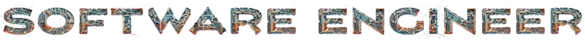

 
<!-- 
-------
| Phase | Name                                                                  | Time    | Content                                                                                                                                                          |
| :---: | :-------------------------------------------------------------------- | :------ | :--------------------------------------------------------------------------------------------------------------------------------------------------------------- |
|   1   | [Programming Basic](#week-one-programming-basics)                     | 7 Days  | Basic computer literacy, Algorithmic foundations, Learning stamina                                                                                               |
|   2   | [Web Fundamentals](#weeks-two-to-four-web-fundamentels)               | 21 Days | HTML, CSS, Git/Github, HTTP Request Response, Optional: jQuery & Wireframing                                                                       |
|   3   | [Full-Stack Javascript](#weeks-five-to-eight-full-stack-javascript)   | 28 Days | JavaScript Fundamentals & OOP, Node.JS, Express.JS, Socket.io, MongoDB, React, Vue, React Native                                                                      |
|   4   | [Object-Oriented Programming](#)                                      | 7 Days  | OOP Concepts (Encapsulation, Inheritance, Polymorphism, Abstraction, and Composition), Design Principles (DRY, KISS, YAGNI, SOLID, Separation of Concern.)       |
|   5   | [Full-Stack Python](#weeks-nine-to-twelve-full-stack-python)          | 28 Days | Python Fundamentals & OOP, MySQL, Flask, MVC Framework , ERD / Database Design, Web Security Basics, Object Relational Mapper                                    |
|   6   | [Full-Stack Java](#weeks-thirteen-to-sixteen-full-stack-java-or-cnet) | 28 Days | Java Fundamentals & OOP, Java Web Development, Java Spring MVC, Boot, Security, (JPA Hibernate), ThymeLeaf, Tomcat, Deployment                                   |
|   7   | [C#/.NET](#weeks-thirteen-to-sixteen-full-stack-java-or-cnet)         | 28 Days | C# & C# OOP, .NET Core, ASP.NET Core MVC, Application Deployment (Azure & AWS), Identity Framework, Compilation and Debugging                                    |
|   8   | [Expert in DSA](#)                                                    | 21 Days | DSA Foundations, Basic DSA, Basic Algorithms, Basic Maths for Programming, Intermediate Algorithms, Intermediate Data Structures, Advanced Algorithms, Graph DSA | 
-------
-->

<!-- ! Fundamentals -->
## Sections 1: [Fundamentels](./Section-1:Fundamentals/fundamentals.md)
> During Web Fundamentals, you’ll be introduced to HTML, CSS along with other common tools in the industry. At the end of this three week course. To kick off the program, you’ll explore habits, computer basics, and fundamental programming concepts and skills necessary to be successful in your bootcamp!
- [x] Basic computer literacy
- [x] Learning stamina
- [x] C Language
- [x] DSA Foundations
- [x] HTML, CSS
- [x] Git/Github
- [x] HTTP Request Response

<!-- ! FS JavaScript -->
## Sections 2: [Full-Stack Javascript](./Section-2:FullStack-JavaScript/fullstack-javascript.md)
> Mid-program, explore your second full-stack language: JavaScript. Studying a wide-range of applicable formats, students can obtain familiarity with building web applications using common industry technologies like MongoDB, Express, React, and NodeJS.
- [ ] JavaScript Fundamentals & OOP
- [ ] DSA
- [ ] Node.JS
- [ ] Express.JS
- [ ] Socket.io
- [ ] MongoDB
- [ ] React
- [ ] Vue
- [ ] React Native
- [ ] Electron

<!-- ! FS Python -->
## Sections 3: [Full-Stack Python](./Section-3:FullStack-Python/)
> Dive into the first full-stack language: Python. Beginning with small projects, you’ll work your way up to designing a full framework project alongside your classmates and instructor.
- [ ]  Python Fundamentals & OOP
- [ ]  MySQL
- [ ]  Flask
- [ ]  MVC Framework 
- [ ]  ERD / Database Design
- [ ]  Web Security Basics
- [ ]  Object Relational Mapper

### Data Science

## Sections 4: [Full-Stack Java or C#/.NET](./Section-4:Java||C#(.NET)/)
> For your last full-stack language, students will select either Java or C#/.NET in the last 4 weeks of their course.

### Java
> Study procedural programming in Java using popular frameworks and build and manipulate databases in programs like MySQL.
- [ ] Java Fundamentals & OOP
- [ ] Java Web Development
- [ ] Java Spring MVC, Boot, Security
- [ ] (JPA Hibernate)
- [ ] ThymeLeaf
- [ ] Tomcat
- [ ] Deployment

### C#/.NET
> Study MVC framework .NET Core, object-oriented programming, fundamentals with C# and manipulating databases in programs like MySQL.
- [ ] C# & C# OOP
- [ ] .NET Core
- [ ] ASP.NET Core MVC
- [ ] Application Deployment (Azure & AWS)
- [ ] Identity Framework
- [ ] Compilation and Debugging

---

- DSA Foundations (Time & Space Complexity Analysis, Recursion, Divide & Conquer) (1.5 weeks; 25 hours)
- Basic DSA (Arrays, Linked List, Stack, Queue, Searching, Sorting) (3 weeks; 51 hours)
- Basic Algorithms (Hashing, 2 pointers, Backtracking) (2 weeks; 33 hours)
- Basic Maths for Programming (1.5 weeks; 25 hours)
- Intermediate Algorithms (String Manipulation & Bit Manipulation) (1.5 weeks; 25 hours)
- Intermediate Data Structures (Trees, Set, Map, Heap) (3 weeks; 50 hours)
- Advanced Algorithms (Greedy, DP) (2.5 weeks; 42 hours)
- Graph DSA (2 weeks; 33 hours)

